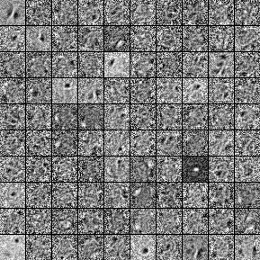
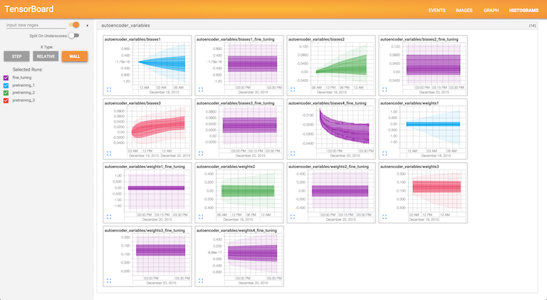

# Deep Autoencoder with TensorFlow

<p align="center">
   
</p>
<p align="center">
A selection of first layer weight filters learned during the pretraining
</p>

## Introduction
The purpose of this repo is to explore the functionality of Google's recently open-sourced
"sofware library for numerical computation using data flow graphs", 
[TensorFlow](https://www.tensorflow.org/). We use the library to train
a deep autoencoder on the MNIST digit data set. For background and a similar implementation using 
[Theano](http://deeplearning.net/software/theano/) see the tutorial at [http://www.deeplearning.net/tutorial/SdA.html](http://www.deeplearning.net/tutorial/SdA.html).

The main training code can be found in [autoencoder.py](https://github.com/cmgreen210/TensorFlowDeepAutoencoder/blob/master/code/ae/autoencoder.py) along with the AutoEncoder class that creates and manages the Variables and Tensors used.

## Docker Setup (CPU version only for the time being)
In order to avoid platform issues it's highly encouraged that you run
the example code in a [Docker](https://www.docker.com/) container. Follow
the Docker installation instructions on the website. Then run:

```bash
$ git clone https://github.com/cmgreen210/TensorFlowDeepAutoencoder
$ cd TensorFlowDeepAutoencoder
$ docker build -t tfdae -f cpu/Dockerfile .
$ docker run -it -p 80:6006 tfdae python run.py
```

Navigate to <a href="http://localhost:80" target="_blank">http://localhost:80</a>
to explore [TensorBoard](https://www.tensorflow.org/versions/master/how_tos/summaries_and_tensorboard/index.html#tensorboard-visualizing-learning) and view the training progress.
<p align="center">
   
</p>
<p align="center">
View of TensorBoard's display of weight and bias parameter progress.
</p>
## Customizing
You can play around with the run options, including the neural net size and shape, input corruption, learning rates, etc.
in [flags.py](https://github.com/cmgreen210/TensorFlowDeepAutoencoder/blob/master/code/ae/utils/flags.py).

## Old Setup
It is expected that Python2.7 is installed and your default python version.
### Ubuntu/Linux
```bash
$ git clone https://github.com/cmgreen210/TensorFlowDeepAutoencoder
$ cd TensorFlowDeepAutoencoder
$ sudo chmod +x setup_linux
$ sudo ./setup_linux  # If you want GPU version specify -g or --gpu
$ source venv/bin/activate 
```
### Mac OS X
```bash
$ git clone https://github.com/cmgreen210/TensorFlowDeepAutoencoder
$ cd TensorFlowDeepAutoencoder
$ sudo chmod +x setup_mac
$ sudo ./setup_mac
$ source venv/bin/activate 
```
## Run
To run the default example execute the following command. 
NOTE: this will take a very long time if you are running on a CPU as opposed to a GPU
```bash
$ python code/run.py
```

Navigate to <a href="http://localhost:6006" target="_blank">http://localhost:6006</a>
to explore [TensorBoard](https://www.tensorflow.org/versions/master/how_tos/summaries_and_tensorboard/index.html#tensorboard-visualizing-learning) and view training progress.
<p align="center">
   
</p>
<p align="center">
View of TensorBoard's display of weight and bias parameter progress.
</p>
## Customizing
You can play around with the run options, including the neural net size and shape, input corruption, learning rates, etc.
in [flags.py](https://github.com/cmgreen210/TensorFlowDeepAutoencoder/blob/master/code/ae/utils/flags.py).
